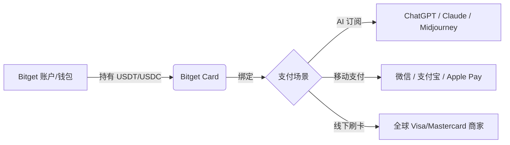

# Bitget Card 终极实测：加密货币如何丝滑进入日常消费与 AI 订阅？

对于加密货币持有者来说，最头疼的问题往往不是行情波动，而是“怎么把手里的 USDT 用出去”。频繁 C2C 出金不仅操作琐碎，还面临银行卡风控的风险。

最近我深度体验了 **Bitget Card**（基于 Bitget Wallet 生态），这张卡彻底打破了 Web3 与现实支付的围墙。它不仅解决了“最后一公里”的消费问题，还顺带搞定了 ChatGPT、Claude 等 AI 服务的订阅难题。

---

## 🚀 核心工作流：从资产到消费

通过 Bitget Card，你的加密资产不再是交易所里的一串数字，而是变成了随时可用的购买力：

---

## 💎 1. 为什么它是目前最“稳”的卡？

### 🌊 海量币种支持
不同于早期只支持几种主流币，现在的 Bitget 支付生态支持 **1,300 多种加密资产** 直接消费。你可以持有你喜欢的任何资产，消费时系统自动实时结算。

### 🛡️ AI 订阅“救星”
由于风控等原因，很多虚拟卡在订阅 OpenAI 或 Anthropic 时会被拒绝。Bitget 对 AI 场景进行了**专项优化**：
- **极高通过率**：正规金融机构签发的 USD 国际卡。
- **专属活动**：经常有“AI 订阅 50% 返现”等补贴。

### 💳 移动支付全兼容
Bitget Card 完美支持 **Apple Pay**、**Google Pay**、**Samsung Pay**。
更重要的是，它能**直接绑定国内的支付宝 (Alipay) 和微信支付 (WeChat Pay)**。无论是点外卖（美团/饿了么）还是打车（滴滴），都能直接扣除你账户里的加密货币。

---

## 📊 2. 费用与额度详情 (2026版)

Bitget Card 的透明度非常高，以下是实测的费用结构：

| 项目 | 费用 / 额度 | 备注 |
| :--- | :--- | :--- |
| **开卡费/年费** | **$0** | 虚拟卡秒下，无持有成本 |
| **交易手续费** | **约 0.9%** | 加密货币兑换法币服务费 |
| **返现比例** | **2% – 8%** | 根据等级和 BGB 持仓返还 |
| **月消费限额** | **$300,000 - $3,000,000** | VIP 级别越高额度越高 |
| **ATM 取现** | $0.65 + 2% | 国内暂不支持 ATM 取现 |

---

## 📝 3. 申请攻略：国内用户避坑指南

针对国内用户，申请过程有几个关键点，请务必严格按照以下步骤操作：

### 🛠️ 准备工作
1.  **有效护照**：必须使用**护照**进行 KYC（身份验证），不支持身份证。
2.  **NFC 手机**：认证过程需要用手机 NFC 感应护照芯片。
3.  **海外 Apple ID**：需准备美区或港区 ID 下载 **Bitget Wallet**。

### ⚠️ 关键细节
- **关闭 VPN**：在 KYC 活体检测和护照扫描阶段，**必须关闭所有 VPN**，否则系统会因 IP 环境异常判定失败。
- **钱包类型**：请确保在 Bitget Wallet 中使用的是“助记词钱包”或“MPC 钱包”。

### 💰 充值建议
建议通过 **Arbitrum** 网络划转 USDT/USDC 进入钱包。Arbitrum 的手续费极低（通常不到 0.1U），到账速度极快，是激活卡片的最佳选择。

---

## 🌟 4. 总结：打通 Web3 生活的最后一环

Bitget Card 并不是简单的“一张卡”，它代表了一种**数字游民**的生活方式。它让你真正拥有了对自己资产的实时支配权——无论是在纽约刷 Visa，还是在北京扫支付宝。

如果你也想告别繁杂的出金流程，或者正为订阅 AI 服务发愁，Bitget Card 是目前市场上最值得推荐的选择。

### 🎁 专属申办福利
点击下方链接申办，可享受新用户专属礼包及返现加成：

👉 [**立即申请 Bitget Card**](https://web3.bgw.live/share/3Bn7vv?inviteCode=30e8NGS8)
*(推荐码：`30e8NGS8`)*

---

*风险提示：加密货币市场具有波动性，请根据自身风险承受能力进行资产配置。*
