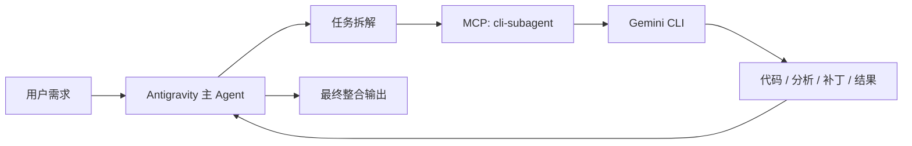

# 把 Google AI Pro 用满：我用 Antigravity 通过 MCP 调度 Gemini CLI 的折腾记录

> 项目仓库：[veegn/cli-subagent](https://github.com/veegn/cli-subagent)  
> 关键词：Google AI Pro、Antigravity、Gemini CLI、MCP、多 Agent 开发、额度复用

这两年大家聊 AI 开发，基本很难绕开 **Multi-Agent**。

表面上看，这玩意儿无非就是把“一个大模型包打天下”拆成“有人负责规划、有人负责执行、有人负责检查、有人负责补锅”的流水线。  
但真正让我动手做这个项目的，不是什么宏大理念，而是一个非常接地气的问题：

**既然我已经付了 Google AI Pro，那这些 AI 额度能不能真正变成开发产能？**

答案是：**可以，而且可以比想象中更工程化。**

这篇文章就是把这条思路从冒头到落地完整捋一遍：  
我是怎么从“最近多 Agent 很火”一路想到 Antigravity 和 Gemini CLI 可能没共用额度；  
为什么最后决定用 MCP 把 Gemini CLI 包成一个“可以被 Antigravity 使唤”的子 Agent；  
以及这个想法最后怎么长成了 [cli-subagent](https://github.com/veegn/cli-subagent)。


<!-- more -->

---

## 一、思路是怎么冒出来的

### 1.1 多 Agent 这事，已经不太像概念片了

现在市面上常见的 AI 开发工作流，大致都在往这个方向走：

1. 一个 Agent 负责理解需求和拆任务
2. 一个或多个 Agent 负责实现具体子任务
3. 另一个 Agent 负责测试、审查和收尾

这套东西其实没那么玄学，本质上就是把复杂问题拆小，让模型每一步都像一个“干单项活的人”，而不是一个想一口气包办所有事情的全能选手。

对写代码来说，这个思路尤其有效，因为编码任务天然就适合拆分：

- 一个子任务只处理单个模块
- 一个子任务只处理测试
- 一个子任务只处理文档
- 一个子任务只处理重构或诊断

也是在不断这么用的过程中，我慢慢意识到另一个问题：

**多 Agent 模式不仅是“更聪明”的问题，还是“更省主额度”的问题。**

### 1.2 真正让我来劲的，不是架构，是额度

我在实际使用过程中观察到一个很重要的现象：

- Antigravity 走的是它自己的模型调用链路
- Gemini CLI 走的是 Google 账号侧的 CLI / 订阅链路

从实际体验上看，这两者至少在当时并**不共用同一份 AI 额度池**

这事一旦成立，味道就不一样了。

这意味着如果我让 Antigravity 继续承担“主控 Agent”的角色，而把细粒度、可拆分、可批量派发的编码任务丢给 Gemini CLI 去做，那么：

- Antigravity 的额度不会被大量细碎执行任务快速打空
- Google AI Pro 的那部分价值也不再只是“偶尔开个 CLI 聊天”
- 我可以把 Gemini CLI 变成一个真正可调度的执行器，而不是一个手工交互工具

下面这两张图，差不多就是我当时脑子里“等一下，这事能搞”的那个瞬间。


*图 1：Gemini CLI 侧可以直接看到独立的模型使用面板，包含 Flash、Flash Lite、Pro 等不同模型的使用比例与重置时间。*


*图 2：Antigravity 侧则展示了另一套配额体系，包括 AI Credits、模型配额以及各模型各自的刷新周期。*

关键不在于数字具体是多少，而在于这两边明显像是两套不同的记账方式：

- Gemini CLI 更像是 Google 账号 / CLI 入口上的模型使用量视图
- Antigravity 更像是它自身产品体系内的 credits + model quota 视图

也正因为这个差异，我才开始认真把它们当成两条可以并行用的能力链路，而不是“看起来是两个入口，实际上还是吃一锅饭”。

到这里，问题就从“能不能利用 Google AI Pro”变成了：

**如何让 Antigravity 稳定地调度 Gemini CLI？**

---

## 二、为什么最后选了 MCP

### 2.1 我需要的不是“套壳调用”，而是“被 Agent 理解的工具”

如果只是想“程序里调一下 Gemini CLI”，其实一点都不难。

最粗暴的办法有很多：

- shell 脚本包一层
- HTTP 服务包一层
- 直接在代码里 `spawn` 子进程

但这些办法都有个共同问题：

**它们对程序员友好，对 Agent 不友好。**

我需要的不是“写个脚本能跑 Gemini CLI”，而是让 Antigravity 真把 Gemini CLI 当成一个结构化工具来理解：

- 这个工具接受什么参数
- 它适合做什么任务
- 它会产出什么结果
- 它失败时应该怎么处理

这正是 MCP 最适合解决的问题。

### 2.2 MCP 的价值，在于把执行器变成“标准能力”

MCP 最有用的地方不是“新”，而是“清楚”：

- 输入是结构化的
- 输出是结构化的
- 工具描述是显式的
- Agent 可以根据工具 schema 做任务选择和参数构造

换句话说，MCP 不是单纯“远程调一个命令”，而是把 Gemini CLI 包装成一个 **Agent 可消费的执行能力**。

于是，一个很自然的结构就出来了：



这套结构最关键的点是：

**Antigravity 不需要自己执行所有细节，它只需要决定“哪些任务值得派给 Gemini CLI”。**

---

## 三、这个思路落到工程上，到底长什么样

下面这张图，基本就是 `cli-subagent` 的核心思路：


### 3.1 角色分工

在这套设计里，几个角色不是平起平坐的。

#### Antigravity：总控与编排者

它负责：

- 接收用户需求
- 判断是否需要拆分为子任务
- 选择哪些任务适合下发给 Gemini CLI
- 收集执行结果并二次整合

你可以把它理解成项目经理兼技术负责人。

#### Gemini CLI：细化任务执行器

它负责：

- 根据单一任务目标生成代码或分析结果
- 在更小上下文中专注完成一个明确子问题
- 返回文本结果、补丁思路或执行产物

它更像一个“被派活的专职开发”。

#### cli-subagent：协议桥梁

它负责：

- 把 Gemini CLI 暴露成 MCP 工具
- 统一参数、超时、工作目录、输出格式
- 让 Antigravity 能稳定地把任务派过去

它不是模型本身，更像一个把模型接进工作流的中间层。

---

## 四、从想法到实现，中间踩了哪些坑

这个项目真正麻烦的地方，不是“能不能调 CLI”，而是“怎么把这件事做得足够稳，稳到能塞进日常工作流里”。

### 4.1 第一个坑：子任务边界必须足够窄

如果你给 Gemini CLI 一个模糊任务，比如：

> 帮我把整个项目重构一下，并修复已知问题

那么这类任务既吃上下文，又不可控，还很难判断结果好坏。

但如果你把任务改成：

- 只改某个模块
- 只生成某个测试文件
- 只分析一处报错
- 只输出重构方案，不直接改代码

执行质量就会明显好很多。

这也是为什么我后来越来越明确：

**多 Agent 模式里的“拆任务”不是锦上添花，而是成败分界线。**

### 4.2 第二个坑：工作目录和上下文隔离

CLI 型执行器最容易出现的问题之一，就是上下文污染。

例如：

- 上一个任务切了目录
- 上一个任务写了临时文件
- 上一个任务输出过长，影响后续判断

如果不把这些边界卡住，整个系统很快就会开始长出奇奇怪怪的问题。

所以 `cli-subagent` 在设计上必须强调几件事：

- 每次任务都显式指定工作目录
- 输入尽量结构化，减少隐式上下文
- 输出要可控，不能无限膨胀
- 最好区分“只分析”和“允许改动”的模式

### 4.3 第三个坑：失败并不可怕，不可恢复才可怕

一个真能进生产工作流的子 Agent，就不该默认“它每次都会很乖地成功”。

因此它至少要具备这些特征：

- 超时后能退出
- 错误时能返回明确失败信息
- 输出不合法时主 Agent 可以重新派发
- 任务失败不会把整个主工作流拖死

这也是我后来更看重 MCP 方案的原因之一：

**MCP 不只是“更好接”，也是“更好失败”。**

---

## 五、cli-subagent 最小能跑起来的样子

如果把整个系统压缩成最小动作，其实就是下面这几个阶段。

### 5.1 阶段一：主 Agent 决定是否外包

例如用户提出一个比较大的开发需求：

> 给一个现有 CLI 工具补一个配置校验层，并补测试和 README

Antigravity 这时候不用急着亲自下场写完所有东西，而是先判断：

- 这个任务能拆吗？
- 哪些部分适合外包给 Gemini CLI？
- 哪些部分必须保留在主 Agent 这里做整合？

### 5.2 阶段二：把任务转成单一执行单元

例如拆成：

1. 设计 `config` schema 与校验逻辑
2. 为 schema 写单元测试
3. 输出 README 的配置示例

每一个都足够明确，边界清楚，上下文也不大。

### 5.3 阶段三：通过 MCP 调用 Gemini CLI

伪配置可以大致理解为：

```json
{
  "mcpServers": {
    "cli-subagent": {
      "command": "node",
      "args": ["./dist/index.js"]
    }
  }
}
```

而主 Agent 发出的任务更像：

```json
{
  "task": "为 config schema 设计校验规则并给出实现代码",
  "cwd": "/workspace/my-project",
  "mode": "analysis_or_patch",
  "constraints": [
    "不要改动无关文件",
    "优先输出可直接落地的 TypeScript 代码"
  ]
}
```

### 5.4 阶段四：主 Agent 回收结果并做最终拼装

Gemini CLI 的结果回来以后，Antigravity 再决定：

- 是否直接接受
- 是否发起二次修正
- 是否让另一个 Agent 做 review
- 是否把多份结果整合成最终输出

这样才会形成一个像样的“主控 + 执行器”关系，而不是两个模型在那里各聊各的。

---

## 六、这件事为什么能把 Google AI Pro 用得更值

这里先说清楚：我讨论的是 **工程使用策略**，不是猜官方阈值，也不是研究什么平台漏洞。

重点在于：

**如果你的工作流里同时存在 Antigravity 和 Gemini CLI 两条调用链路，那么就有机会把 Google AI Pro 的价值从“一个单独工具”升级成“可被调度的执行层”。**

这事带来的收益，我自己感觉主要有三点。

### 6.1 把订阅价值从“聊天入口”变成“产能入口”

很多人买完订阅之后，使用方式还是：

- 偶尔问问题
- 偶尔让 CLI 写一段代码
- 偶尔做点分析

这种用法当然没问题，但更像“想起来就点一下”的单点使用。

而一旦把 Gemini CLI 放进可调度架构里，它的角色就变了：

- 它可以持续处理可拆分的细任务
- 它可以被主 Agent 自动调用
- 它不再依赖手工频繁切换上下文

也就是说，**订阅额度终于不只是心理安慰，而是真开始参与系统吞吐了。**

### 6.2 主 Agent 不再被细碎执行拖垮

很多时候真正烧额度的，不是大问题本身，而是大量零碎任务：

- 改一个函数
- 补一组测试
- 生成一段配置
- 重写一段文档

如果这些全都由主 Agent 自己完成，那么主 Agent 的上下文和额度都会被快速消耗。

而如果这些细碎任务被 Gemini CLI 承接，主 Agent 就能把更多预算留给：

- 任务规划
- 结果整合
- 架构判断
- 最终交付

### 6.3 更适合“工程化批处理”

一旦一个执行器能被 MCP 调度，它就天然适合做批量任务：

- 批量补测试
- 批量补注释
- 批量生成配置迁移说明
- 批量扫描并修复重复问题

这些事非常适合 Gemini CLI 这种“单任务执行器”，也是 Google AI Pro 最容易被真正跑满的场景。

---

## 七、举个很实际的场景

下面给一个很具体、也很容易代入的开发场景。

### 场景：给一个 Node.js 项目加配置校验层

如果没有 `cli-subagent`，你大概率会这么做：

1. 自己手工跟主 Agent 来回聊
2. 主 Agent 一次做 schema、一次做测试、一次做文档
3. 中间不断复制粘贴结果

而引入 `cli-subagent` 后，流程可以变成：

1. Antigravity 先拆任务
2. 通过 MCP 把 schema 设计派给 Gemini CLI
3. 再把测试生成派给 Gemini CLI
4. 最后把 README 示例派给 Gemini CLI
5. Antigravity 回收三份结果，做 review 和整合

这套流程的好处不只是“自动化更多”，而是：

- 主 Agent 的思考链更干净
- 子任务的上下文更专注
- Gemini CLI 的额度被真正用于执行
- 整个过程更接近团队协作，而不是单线程问答

---

## 八、为什么这东西最后值得单独做成一个仓库

如果它只是个一次性脚本，那真没必要单独开源。

我之所以把它做成 [cli-subagent](https://github.com/veegn/cli-subagent)，是因为我越来越确定：

**这不是一段 glue code，而是一种可复用的开发模式。**

它解决的不是“怎么跑一次 Gemini CLI”，而是：

- 怎么把 CLI 型模型能力接入 Agent 编排体系
- 怎么把订阅额度转成工程吞吐
- 怎么让一个执行器在多 Agent 工作流中稳定存在

从这个角度看，`cli-subagent` 的真正价值不在于它绑定了 Gemini CLI，而在于它证明了一件事：

**“主控 Agent + 外部执行器 + MCP 桥接”是可以落地、可复用、可扩展的。**

今天它调度的是 Gemini CLI，明天也完全可以是别的 CLI 型能力。

---

## 九、如果你也想这么玩

如果你也想把 Google AI Pro 更扎实地塞进开发工作流，我的建议是：

### 9.1 先把 Gemini CLI 当执行器，不要当总控

它更适合：

- 细粒度开发任务
- 局部分析
- 文档生成
- 小范围补丁

而不一定适合直接承担整个复杂流程的全局编排。

### 9.2 任务一定要细

不要一上来就派：

- “把整个仓库重构一遍”
- “把所有 bug 一次修完”

更好的派发方式是：

- “只修这个模块”
- “只补这一层测试”
- “只输出这个函数的替代实现”

### 9.3 把失败当成正常路径设计

要预设这些事情一定会发生：

- 子任务超时
- 输出偏题
- 结果不稳定
- 需要重试或回退

只要主流程能恢复，子 Agent 的失败就不是问题。

### 9.4 明确“哪些页面/代码值得主 Agent 亲自收口”

例如：

- 架构层决策
- 关键 review
- 最终结果合并
- 面向用户的最终回答

这些通常仍然适合由主 Agent 负责。

---

## 十、结尾

这篇文章真正想说的，不是“Gemini CLI 很强”或者“Antigravity 很灵活”。

我更关心的是另一件事：

**当 AI 工具越来越多时，我们不能只把它们当成一个个孤立入口，而应该开始思考：能否把不同入口的能力、额度和交互方式，重组为一个更像“系统”的工作流。**

`cli-subagent` 就是在这个背景下长出来的。

它不是从“我要做个 MCP 工具”这个念头开始的，而是从一个非常朴素的问题开始的：

> 我已经有 Google AI Pro 了，能不能把它真正变成开发产能？

最后的答案是：

**可以。**

而且这件事最有意思的地方在于，它并不是靠一个更大的单体 Agent 硬顶出来的，恰恰相反，它是靠更清楚的任务拆分、更明确的角色分工，以及更标准化的能力桥接跑出来的。

这也许正是多 Agent 开发模式真正值得关注的地方。

---

## 附：文章里的两个核心判断

如果你只记住两句话，我希望是这两句：

1. **多 Agent 模式不只是为了更聪明，也是为了更高效地使用不同模型与额度池。**
2. **MCP 的真正价值不是“能调工具”，而是让执行器变成主 Agent 可理解、可编排、可恢复的标准能力。**

如果你也在折腾 Antigravity、Gemini CLI，或者别的 CLI 型 AI 工具，也许可以试试这个思路。

有时候，真正值得优化的不是 prompt，而是系统边界。
